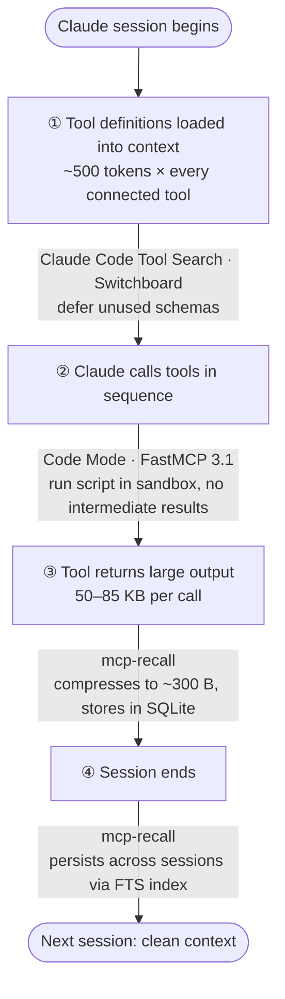
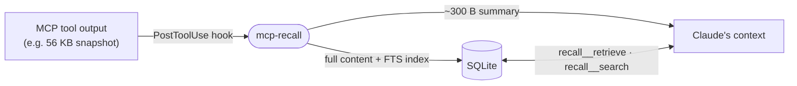
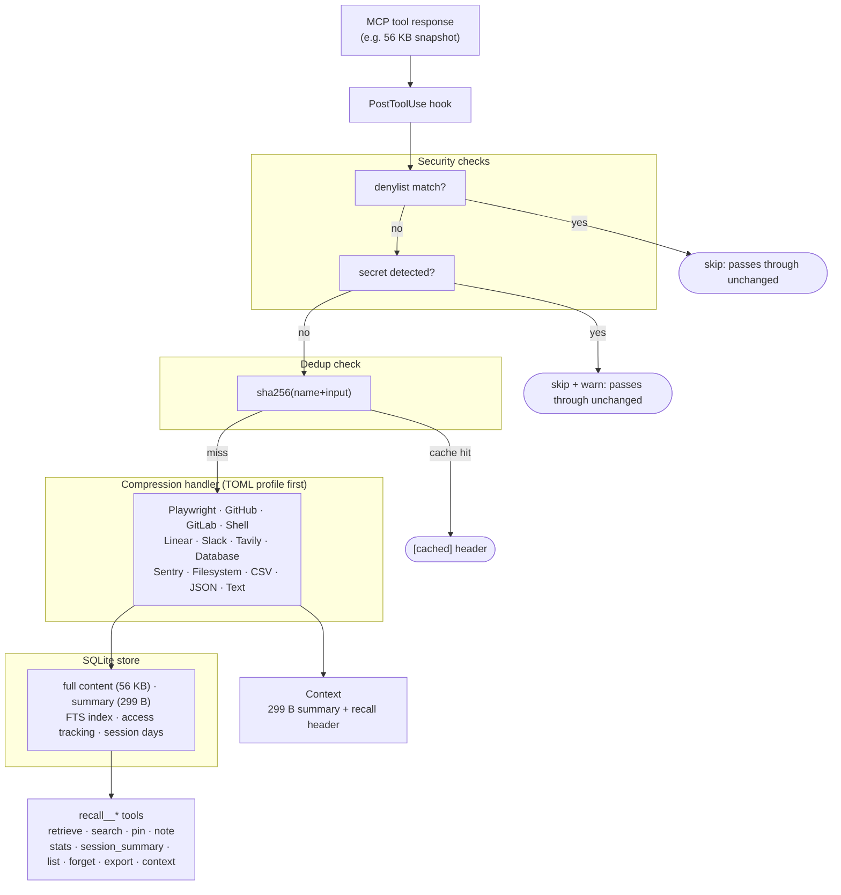

# mcp-recall


**Your context window is finite. MCP tool outputs aren't. mcp-recall bridges the gap.**

MCP tool outputs — Playwright snapshots, GitHub issues, file reads — can consume tens of kilobytes of context per call. A 200K token context window fills up in ~30 minutes of active MCP use. mcp-recall intercepts those outputs, stores them in full locally, and delivers compressed summaries to Claude instead. When Claude needs more detail, it retrieves exactly what it needs via FTS search — without re-running the tool.

Sessions that used to hit context limits in 30 minutes routinely run for 3+ hours.


---

## The full context stack

Context pressure builds at four distinct layers. mcp-recall targets the two that nothing else handles.



| Layer | Problem | Solution |
|---|---|---|
| **① Tool definitions** | Every connected MCP loads its full schema upfront (~500 tokens/tool) | [Claude Code Tool Search](https://code.claude.com/docs/en/mcp#scale-with-mcp-tool-search) (built-in) · Switchboard |
| **② Intermediate results** | Multi-step workflows pass each result back through context | [Code Mode](https://blog.cloudflare.com/code-mode/) · [FastMCP 3.1](https://www.jlowin.dev/blog/fastmcp-3-1-code-mode) |
| **③ Single-tool outputs** | One snapshot or API response dumps 50–85 KB | **mcp-recall** |
| **④ Cross-session memory** | Useful context disappears when the session ends | **mcp-recall** |

Layers ① and ② have solid first-party and community solutions. mcp-recall focuses on ③ and ④ — the outputs that do land in context, and the knowledge that shouldn't vanish when the session ends. All four layers stack: run them together for maximum efficiency.

---

## How it works



<details>
<summary>Detailed pipeline</summary>



</details>

**Two hooks, one MCP server.**

- `SessionStart` hook — records each active day, prunes expired items, and injects a compact context snapshot before the first message
- `PostToolUse` hook — intercepts MCP tool outputs and native Bash commands; deduplicates identical calls; compresses, stores, and returns summary
- `recall` MCP server — exposes ten tools for retrieval, search, memory, and management

> **Scope**: Compression applies to MCP tools and the native `Bash` built-in. The remaining built-ins (Read, Grep, Glob) pass through unchanged. See [Scope](#scope) for details.

---

## Results

Real numbers from actual tool calls:

| Tool | Original | Delivered | Reduction |
|---|---|---|---|
| `mcp__playwright__snapshot` | 56.2 KB | 299 B | 99.5% |
| `mcp__github__list_issues` (20 items) | 59.1 KB | 1.1 KB | 98.1% |
| `mcp__filesystem__read_file` (large file) | 85.0 KB | 2.2 KB | 97.4% |
| Analytics CSV (500 rows) | 85.0 KB | 222 B | 99.7% |

Across a full session: 315 KB of tool output → 5.4 KB delivered to context.

---

## Install

### Prerequisites

- [Claude Code](https://claude.ai/claude-code) installed
- [Bun](https://bun.sh) installed — `curl -fsSL https://bun.sh/install | bash`

### Option A — npm (recommended)

No global install required — run directly with npx or bunx:

```bash
npx mcp-recall install   # or: bunx mcp-recall install
```

Or install globally for faster subsequent runs:

```bash
bun add -g mcp-recall    # or: npm i -g mcp-recall
mcp-recall install       # register hooks + MCP server in Claude Code
mcp-recall status        # verify
```

`mcp-recall install` writes the MCP server entry and hooks to `~/.claude.json` and `~/.claude/settings.json`, and adds a short instruction block to `~/.claude/CLAUDE.md` so Claude knows how to use the recall tools. It's idempotent — safe to re-run after updates.

A fully installed `mcp-recall status` looks like this:

```
Installation: installed

  ~/.claude.json                    ✓ mcpServers.recall
  ~/.claude/settings.json           ✓ SessionStart hook
                                    ✓ PostToolUse hook
  ~/.claude/CLAUDE.md               ✓ mcp-recall instructions

  Build artifacts
    dist/server.js                  ✓ /path/to/dist/server.js
    dist/cli.js                     ✓ /path/to/dist/cli.js

  ✓ Profiles: 12 installed (4 user, 8 community)
```

Update: `bun update -g mcp-recall && mcp-recall install`

Uninstall: `mcp-recall uninstall && bun remove -g mcp-recall`

### Option B — Claude Code plugin marketplace

```bash
claude plugin marketplace add mcp-recall https://github.com/sakebomb/mcp-recall
claude plugin install mcp-recall@mcp-recall
```

Both hooks and the MCP server register automatically. Verify with `claude --debug`.

### Option C — from source

```bash
git clone https://github.com/sakebomb/mcp-recall
cd mcp-recall
bun install
bun run build
./bin/recall install
```

The `mcp-recall` binary is not on PATH for source installs. Add an alias so the CLI works everywhere:

```bash
echo 'alias mcp-recall="bun /path/to/mcp-recall/plugins/mcp-recall/dist/cli.js"' >> ~/.zshrc
source ~/.zshrc
```

Or symlink it:

```bash
ln -sf /path/to/mcp-recall/plugins/mcp-recall/dist/cli.js ~/.local/bin/mcp-recall
```

---

## Updating

### Option A — npm / bun global install

```bash
bun update -g mcp-recall && mcp-recall install
```

`mcp-recall install` is idempotent — it updates hook paths and the MCP server entry in place without touching your stored data or config.

### Option B — Claude Code plugin marketplace

```bash
claude plugin update mcp-recall@mcp-recall
```

### Option C — from source

```bash
git pull
bun install
bun run build
mcp-recall install   # re-registers hooks with the new binary path
```

### After updating

Run `mcp-recall status` to confirm the new version is active and hooks are registered correctly. Then update community profiles to pick up any new or revised ones:

```bash
mcp-recall profiles update
```

---

## Profiles

Profiles teach mcp-recall how to compress output from specific MCPs. **[18 community profiles](https://github.com/sakebomb/mcp-recall-profiles)** cover Jira, Stripe, Grafana, Shopify, Notion, and more.

```bash
# Install profiles for all your connected MCPs
mcp-recall profiles seed

# Or install the full community catalog at once
mcp-recall profiles seed --all

# See what's available in the community catalog (add --verbose for MCP URLs)
mcp-recall profiles available

# See what's installed (accepts short names: "grafana" not "mcp__grafana")
mcp-recall profiles list

# Get full metadata for a profile (manifest-first, falls back to local data offline)
mcp-recall profiles info grafana

# Keep profiles up to date
mcp-recall profiles update
```

→ [Profiles quickstart](docs/profiles-quickstart.md) · [Profile schema](docs/profile-schema.md) · [Community catalog](https://github.com/sakebomb/mcp-recall-profiles)

---

## Configuration

mcp-recall works out of the box. To customize, create `~/.config/mcp-recall/config.toml`:

```toml
[store]
# Days of actual Claude Code use before stored items expire.
# Vacations and context switches to other projects don't count —
# only days you actively used Claude Code on this project.
# See "Session days" below.
expire_after_session_days = 30

# How to identify a project.
# "git_root" is recommended — stable regardless of launch directory.
# Falls back to "cwd" if not inside a git repo.
key = "git_root"

# Hard cap on store size in megabytes. Least-frequently-accessed
# non-pinned items are evicted when this limit is exceeded.
max_size_mb = 500

# Access count threshold for pin suggestions in recall__stats.
# Items accessed at least this many times will appear as pin candidates.
pin_recommendation_threshold = 5

# Days since creation before a never-accessed item appears as a stale candidate
# in recall__stats. Helps identify stored output that was never retrieved.
stale_item_days = 3

[retrieve]
# Max bytes returned by recall__retrieve() when no query is provided.
# Claude can override this per-call via the max_bytes parameter.
default_max_bytes = 8192

[denylist]
# Additional tool name glob patterns to never store.
# These extend the built-in defaults — they don't replace them.
additional = [
  # "*myserver*secret*",
]

# Allowlist — tools matching these patterns are always stored,
# even if they match a deny pattern. Use when a legitimate tool
# is blocked by a keyword pattern (e.g. *token* blocking your
# analytics tool).
allowlist = [
  # "mcp__myservice__list_authors",
]

# Replace built-in defaults entirely (use sparingly).
# Must re-specify any defaults you still want.
override_defaults = [
  # "mcp__recall__*",
  # "mcp__1password__*",
]

[profiles]
# Manifest signature verification mode when installing/updating community profiles.
# Requires the gh CLI. Options: "warn" (default), "error", "skip".
verify_signature = "warn"
```

### Session days

The `expire_after_session_days` setting counts **days you actively use Claude Code on this project** — not calendar days. If you work on a task on Monday, leave for a week, and come back the following Tuesday, your stored context is still exactly as you left it. The counter only advances when you open a session.

This means a 7-day setting gives you 7 working sessions of stored context, regardless of how much calendar time passes between them.

---

## Tools

Ten `recall__*` tools are available to Claude in every session. The `recall__` prefix is the MCP naming convention — it namespaces the tools so Claude knows which plugin owns them. You don't call these yourself; Claude uses them automatically.

| Tool | Use when |
|---|---|
| `recall__context` | Start of session — get pinned items, notes, and recent activity |
| `recall__retrieve(id, query?)` | Need detail from a prior tool call |
| `recall__search(query, tool?)` | Find stored output by content, no ID needed |
| `recall__pin(id)` | Protect an item from expiry and eviction |
| `recall__note(text, title?)` | Store a conclusion or decision as project memory |
| `recall__stats()` | Session efficiency report with savings and suggestions |
| `recall__session_summary(date?)` | Digest of a specific session's activity |
| `recall__list_stored(sort?, tool?)` | Browse stored items |
| `recall__forget(...)` | Delete by id, tool, session, age, or all |
| `recall__export()` | JSON dump of all stored items |

→ [Full tool reference](docs/tools.md)

---

## Compression handlers

Handlers are selected by tool name, with content-based fallback. Every compressed result includes a header line:

```
[recall:recall_abc12345 · 56.2KB→299B (99% reduction)]
```

Repeated identical tool calls return a cached header instead of re-compressing:

```
[recall:recall_abc12345 · cached · 2026-03-01]
```

| Handler | Matches | Strategy |
|---|---|---|
| Bash | native `Bash` tool | CLI-aware routing on `tool_input.command`: `git diff`/`git show` → changed-files summary with per-file +/- stats; `git log` → 20-commit cap; `terraform plan` → resource action symbols + Plan: summary; `git status` → staged/unstaged counts + branch info; `npm`/`bun`/`yarn`/`pip install` → success or error summary (pnpm → shell compression); `pytest`/`jest`/`bun test`/`vitest`/`go test` → pass/fail counts + failure names; `docker ps` → container name/image/status/ports; `make`/`just` → target + outcome; everything else → shell handler. |
| Playwright | tool name contains `playwright` and `snapshot` | Interactive elements (buttons, inputs, links), visible text, headings. Drops aria noise. |
| GitHub | `mcp__github__*` | Number, title, state, body (200 chars), labels, URL. Lists: first 10 + overflow count. |
| GitLab | `mcp__gitlab__*` | IID, title, state, description excerpt (200 chars), labels, web URL. Lists: first 10 + overflow count. |
| Shell | tool name contains `bash`, `shell`, `terminal`, `run_command`, `ssh_exec`, `exec_command`, `remote_exec`, or `container_exec` | Strips ANSI escape codes and SSH post-quantum advisory noise. Parses structured `{stdout, stderr, returncode}` JSON; falls back to plain text. Stdout: first 50 lines + overflow count. Stderr: first 20 lines, shown in a separate section. Exit code in header. |
| Linear | tool name contains `linear` | Identifier, title, state, priority (numeric → label), description excerpt (200 chars), URL. Handles single, array, GraphQL, and Relay shapes. |
| Slack | tool name contains `slack` | Channel, formatted timestamp, user/display name, message text (200 chars). Handles `{ok, messages}` wrappers and bare arrays. Lists: first 10 + overflow count. |
| Tavily | tool name contains `tavily` | Query header, synthesized answer in full, per-result title + URL + 150-char content snippet. Drops `raw_content`, `score`, `response_time`. Lists: first 10 + overflow count. |
| Database | tool name contains `postgres`, `mysql`, `sqlite`, or `database` | Row/column count header, column names, first 10 rows as col=value pairs. Handles node-postgres `{rows, fields}`, bare array, and `{results}` wrapper shapes. |
| Sentry | tool name contains `sentry` | Exception type + message, level, environment, release, event ID. Last 8 stack frames (innermost/most relevant). Drops breadcrumbs, SDK info, request headers. |
| Filesystem | `mcp__filesystem__*` or tool name contains `read_file` / `get_file` | Line count header + first 50 lines + truncation notice. |
| CSV | tool name contains `csv`, or content-based detection | Column headers + first 5 data rows as key=value pairs + row/col count. Handles quoted fields. |
| Generic JSON | Any unmatched tool with JSON output | 3-level depth limit, arrays capped at 3 items with overflow count. |
| Generic text | Everything else | First 500 chars + ellipsis. |

The generic JSON handler is intentionally conservative — it keeps structure and marks what was dropped. Correctness matters more than compression ratio.

Credential tools are never stored. Password managers are blocked by explicit name (`mcp__1password__*`, `mcp__bitwarden__*`, `mcp__lastpass__*`, `mcp__dashlane__*`, `mcp__keeper__*`, `mcp__hashicorp_vault__*`, `mcp__vault__*`, `mcp__doppler__*`, `mcp__infisical__*`) because their tool names — `get_item`, `list_logins`, `vault read` — don't contain obvious credential keywords. Keyword patterns catch remaining credential-adjacent names: `*secret*`, `*token*`, `*password*`, `*credential*`, `*api_key*`, `*access_key*`, `*private_key*`, `*signing_key*`, `*oauth*`, `*auth_token*`, `*authenticate*`, `*env_var*`, `*dotenv*`. Output is also scanned for secret patterns (PEM headers, GitHub PATs, AWS keys, etc.) before any write. If a legitimate tool is blocked by a keyword pattern, add it to `denylist.allowlist` in your config. See [SECURITY.md](SECURITY.md) for details.

---

## Scope

**Compression applies to MCP tools and the native Bash built-in.**

Claude Code's `PostToolUse` hook supports output replacement for MCP tools and the `Bash` tool. mcp-recall intercepts both:

- **MCP tools** (`mcp__*`) — all compression handlers apply (Playwright, GitHub, GitLab, filesystem, shell/remote-exec, Linear, Slack, Tavily, database query results, Sentry events, CSV, JSON, generic text)
- **Bash** — CLI-aware handlers: `git diff`/`git show` → file-level summary; `git log` → 20-commit cap; `terraform plan` → resource action summary; `git status` → staged/unstaged counts; package install (npm/bun/yarn/pip) → success/error summary; test runners (pytest/jest/bun test/vitest/go test) → pass/fail counts; `docker ps` → container list; `make`/`just` → target + outcome; everything else → 50-line shell cap with ANSI stripping

The remaining built-in tools — `Read`, `Grep`, `Glob` — do not support output replacement. Their full output enters context directly. If large file reads are your biggest context consumer, consider the [filesystem MCP server](https://github.com/modelcontextprotocol/servers) instead of the built-in Read tool.

---

## Privacy

All stored data lives locally on your machine at `~/.local/share/mcp-recall/`. Nothing is sent to any external service. The SQLite database contains full tool outputs — treat it accordingly.

To wipe all stored data for the current project:

```
recall__forget(all: true, confirmed: true)
```

Or delete the directory directly:

```bash
rm -rf ~/.local/share/mcp-recall/
```

---

## Error contract

mcp-recall never breaks a tool call. Every failure mode — hook crash, SQLite error, handler exception, timeout, secret detected — degrades gracefully to the original uncompressed output passing through unchanged. The session gets slightly worse context efficiency. It never gets broken.

---

## Troubleshooting

→ [Troubleshooting guide](docs/troubleshooting.md)

---

## Profile system

Declarative TOML profiles extend compression to any MCP — no TypeScript required. **[18 community profiles](https://github.com/sakebomb/mcp-recall-profiles)** cover Jira, Stripe, Shopify, Datadog, Notion, Teams, and more.

```bash
mcp-recall learn                         # auto-generate profiles from your installed MCPs
mcp-recall profiles seed                 # install community profiles for detected MCPs
mcp-recall profiles available            # browse the community catalog with install status
mcp-recall profiles info <name>          # full metadata for any profile (works offline)
mcp-recall profiles install <name>       # install by short name, e.g. "grafana"
mcp-recall profiles retrain              # suggest field additions using your stored data
mcp-recall profiles test <tool>          # apply a profile and show compression result
mcp-recall profiles list                 # show all installed profiles
```

→ [Profiles quickstart](docs/profiles-quickstart.md) · [Profile schema](docs/profile-schema.md) · [retrain guide](docs/retrain.md) · [AI profile guide](docs/ai-profile-guide.md) · [Contributing a profile](CONTRIBUTING.md#contributing-a-profile)

---

## Development

```bash
git clone https://github.com/sakebomb/mcp-recall
cd mcp-recall
bun install
bun test
```

See [CONTRIBUTING.md](CONTRIBUTING.md) for project structure, workflow, and how to add a new compression handler.

---

## What's next

The easiest way to contribute is a TOML profile — no TypeScript, no clone of this repo needed. If you use an MCP that isn't covered, check the [community profiles repo](https://github.com/sakebomb/mcp-recall-profiles) or open a [profile request](https://github.com/sakebomb/mcp-recall/issues/new?template=profile-request.md).

TypeScript handlers are welcome for tools with complex, non-JSON output (HTML, DOM trees, binary formats) — see [CONTRIBUTING.md](CONTRIBUTING.md).

---

## License

MIT — see [LICENSE](LICENSE)
