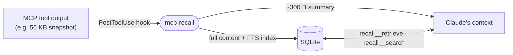

# mcp-recall

[](https://github.com/sakebomb/mcp-recall/actions/workflows/ci.yml)
[](https://www.npmjs.com/package/mcp-recall)
[](https://www.npmjs.com/package/mcp-recall)


[](CONTRIBUTING.md)


**Your context window is finite. Tool outputs aren't. mcp-recall bridges the gap.**

MCP tool outputs (Playwright snapshots, GitHub API responses, Linear queries) and long Bash output can consume tens of kilobytes of context per call, and a busy session fills even a large context window long before the work is done. mcp-recall intercepts those outputs, stores them in full locally, and delivers compressed summaries to Claude instead. When Claude needs more detail, it retrieves exactly what it needs via full-text search, without re-running the tool.

The goal is sessions that run for hours instead of hitting the context limit in minutes. [Results](#results) shows what is measured today.


---

## Quick start

You need [Claude Code](https://claude.ai/claude-code) and [Bun](https://bun.sh) (`curl -fsSL https://bun.sh/install | bash`).

```bash
bun add -g mcp-recall    # or: npm i -g mcp-recall
mcp-recall install       # register the hooks and MCP server in Claude Code
mcp-recall profiles seed # optional: compression profiles for the MCPs you use
```

Restart Claude Code, then run `mcp-recall status`: every check should be green. That's it. Claude now receives summaries, and uses the `recall__*` tools when it needs the full output.

`mcp-recall install` writes the MCP server entry and hooks to `~/.claude.json` and `~/.claude/settings.json`, and adds a short instruction block to `~/.claude/CLAUDE.md`. It is idempotent, so re-run it after every update.

→ [Quickstart](docs/quickstart.md) · [All install options, updating and uninstalling](docs/install.md) (plugin marketplace, from source)

---

## How it works


```mermaid
flowchart LR
    A["MCP tool output\n(e.g. 56 KB snapshot)"] -->|"PostToolUse hook"| B(["mcp-recall"])
    B -->|"~300 B summary"| C["Claude's context"]
    B -->|"full content + FTS index"| D[("SQLite")]
    D <-->|"recall__retrieve · recall__search"| C
```

The [architecture guide](docs/architecture.md#the-capture-pipeline) walks through the full pipeline step by step.

**Two hooks, one MCP server.**

- `SessionStart` hook — records each active day, prunes expired items, and injects a compact context snapshot before the first message
- `PostToolUse` hook — intercepts MCP tool outputs and native Bash commands; deduplicates identical calls (by input) and identical output (by content hash); compresses, stores, and returns summary
- `recall` MCP server — exposes eleven tools for retrieval, search, memory, and management

> **Scope**: Compression applies to MCP tools and the native `Bash` built-in. The remaining built-ins (Read, Grep, Glob) pass through unchanged. See [Scope](#scope) for details.

---

## Using it

Each compressed output starts with a header line that names the stored item, its sizes, and a few `search:` hints, which are salient terms from the full content so Claude's first `recall__search` lands without guessing keywords:

```
[recall:recall_abc12345 · 56.2KB→299B (99% reduction) · search: "checkout", "sessionToken", "orderId"]
```

Repeated identical tool calls return a cached header instead of re-compressing:

```
[recall:recall_abc12345 · cached · 2026-03-01]
```

Eleven `recall__*` tools are available to Claude in every session. The `recall__` prefix is the MCP naming convention — it namespaces the tools so Claude knows which plugin owns them. You don't call these yourself; Claude uses them automatically.

| Tool | Use when |
|---|---|
| `recall__context` | Start of session — get pinned items, notes, and recent activity |
| `recall__retrieve(id, query?, mode?)` | Need detail from a prior tool call — `summary` / `peek` / `full` tiers |
| `recall__search(query, tool?)` | Find stored output by content, no ID needed |
| `recall__pin(id)` | Protect an item from expiry and eviction |
| `recall__note(text, title?)` | Store a conclusion or decision as project memory |
| `recall__stats()` | Session efficiency report with savings and suggestions |
| `recall__session_summary(date?)` | Digest of a specific session's activity |
| `recall__list_stored(sort?, tool?)` | Browse stored items |
| `recall__forget(...)` | Delete by id, tool, session, age, or all |
| `recall__export()` | JSON dump of all stored items |
| `recall__suggest()` | Surface pin candidates and stale items, with the command to act on each |

→ [Full tool reference](docs/tools.md)

---

## Results

> **Before 1.15.1, these savings did not reach Claude's context on current Claude Code.** The hook returned its summary in a field Claude Code no longer reads, so outputs were stored and searchable but Claude still received them in full ([#298](https://github.com/sakebomb/mcp-recall/issues/298)). 1.15.1 uses the documented field, which delivered MCP summaries. Bash summaries were still dropped: Claude Code checks a built-in tool's replacement against that tool's output shape, and a plain string never matched Bash's. From 1.15.2 the hook returns Bash's own shape, and Bash summaries were verified live on Claude Code 2.1.292 ([#304](https://github.com/sakebomb/mcp-recall/issues/304)). The figures below measure what the compression produces.

Measured on 2026-10-07 across one developer's real store: 111 project stores, 98 projects, 38,890 intercepted calls dated 2026-07-21 to 2026-10-07 (older calls had expired). Reproduce on your own store with `bun run measure`, which opens every store read-only and prints aggregates only.

| Figure | Calls | Original | Delivered | Reduction |
|---|---|---|---|---|
| All intercepted calls, as recorded | 38,890 | 69.3 MB | 29.4 MB | **57.6%** |
| Bash, as recorded | 38,704 | 64.3 MB | 26.4 MB | 58.9% |
| MCP, replayed through current handlers | 186 | 5.0 MB | 0.1 MB | **97.0%** |

"As recorded" is what the installed versions' compression produced, using the same accounting as `recall__stats` (notes excluded): 39.9 MB, about 10.5M tokens. Because of #298 that reduction was stored, not delivered to context. The MCP row re-compresses every stored MCP call with today's handlers, because most of those calls were stored by an older release that predated image-block stripping; as recorded they show 40.2%. The replay applies the hook's own rules: a summary that, with its header, is not smaller passes the output through, and an empty summary falls back to the generic handler. It uses the 1.15.1 profiles, so Context7 calls are no longer counted as empty summaries ([#299](https://github.com/sakebomb/mcp-recall/issues/299)). This is one person's workload, dominated by Bash, so your mix will differ.

### What compresses well, and what doesn't

The reduction depends on the shape of the output, not on how large it is. Long, structured, repetitive output compresses well. Short or one-off output has little to remove.

| | Examples (from the measurement above) | Why |
|---|---|---|
| **Excellent, 95–100%** | Tavily extract, Hugging Face, Playwright snapshots, browser screenshots (image blocks stripped) | A dedicated handler or profile keeps only the fields that matter; images carry no searchable text |
| **Good, 75–93%** | Tavily search (85%), Gmail search (91%), `git diff` (93%), `git show` (80%), `cat` of large files (74%) | Structured enough for a handler to summarize; the full text stays retrievable |
| **Moderate, 50–70%** | `sed`, `python3`, `gh`, shell loops, Mermaid rendering (69%) | Mixed output with no dedicated handler; the generic fallback trims the head and tail |
| **Weak, 30–45%** | `grep` (37%), `ssh` (38%), `timeout` (32%), `cd …` chains (43%) | Usually short output, or a wrapper that hides the real command from command-aware routing |
| **Fixed in 1.15.1** | Cloudflare docs search: 37% before, 89% with the new bundled profile | No handler matched it; a profile now extracts title, URL and an excerpt |

Bash rows in this table are as recorded, mostly by releases before 1.14.5, so `grep` (improved in 1.14.5) is likely better today. Small tools with very few calls (for example, three Vikunja calls) are too little data to judge. If a tool you use lands in the weak rows, a [profile](docs/profiles-quickstart.md) is usually the fix.

Individual MCP calls:

| Tool | Original | Delivered | Reduction |
|---|---|---|---|
| `mcp__playwright__snapshot` | 56.2 KB | 299 B | 99.5% |
| `mcp__github__list_issues` (20 items) | 59.1 KB | 1.1 KB | 98.1% |
| `mcp__filesystem__read_file` (large file) | 85.0 KB | 2.2 KB | 97.4% |
| Analytics CSV (500 rows) | 85.0 KB | 222 B | 99.7% |
| Tavily web extracts (12 calls, one session) | 170.3 KB | 2.0 KB | 99% |

Across a full session: 315 KB of tool output → 5.4 KB delivered to context.

Command-aware Bash compression, per-output on representative fixtures (regenerate with `bun run bench`):

| Command | Original | Delivered | Reduction |
|---|---|---|---|
| `find` (400 paths) | 19.0 KB | 1.2 KB | 93.7% |
| `tsc --noEmit` (60 errors) | 28.5 KB | 2.2 KB | 92.4% |
| `rg` (240 matches, 6 files) | 13.6 KB | 1.4 KB | 89.7% |
| `ls -R` (deep tree) | 1.5 KB | 207 B | 86.5% |
| `cargo build` (typical failure) | 1.9 KB | 581 B | 69.8% |
| `git --no-pager diff` (18 files) | 4.1 KB | 1.3 KB | 68.0% |

These are per-output compression ratios, not a whole-session token figure — most outputs are smaller and the generic fallback already caps long output. That is why the measured Bash figure above (58.9%) is lower. For your own session savings, read `recall__stats` (which counts intercepted output only).

Used daily in development of this project since the first release in March 2026. No broken sessions, no data loss.

---
## Profiles

Profiles teach mcp-recall how to compress output from specific MCPs, as declarative TOML with no TypeScript required. Five profiles ship built in (Jira, Gmail, Context7, Docker, Cloudflare docs), and **[26 community profiles](https://github.com/sakebomb/mcp-recall-profiles)** cover Stripe, Grafana, Shopify, Datadog, Notion, Teams, and more.

```bash
mcp-recall profiles seed                 # install community profiles for your connected MCPs
mcp-recall profiles seed --all           # or install the full community catalog
mcp-recall profiles available            # browse the catalog (add --verbose for MCP URLs)
mcp-recall profiles list                 # what's installed (short names work: "grafana")
mcp-recall profiles info <name>          # full metadata (installed first, else catalog)
mcp-recall profiles install <name>       # install one by short name
mcp-recall profiles update               # keep installed profiles up to date
mcp-recall learn                         # generate profiles from your installed MCPs
mcp-recall profiles retrain              # suggest field additions using your stored data
mcp-recall profiles test <tool>          # apply a profile and show the compression result
```

→ [Profiles quickstart](docs/profiles-quickstart.md) · [Profile schema](docs/profile-schema.md) · [retrain guide](docs/retrain.md) · [AI profile guide](docs/ai-profile-guide.md) · [Contributing a profile](CONTRIBUTING.md#contributing-a-profile)

---

## Configuration

mcp-recall works out of the box. To customize it, create `~/.config/mcp-recall/config.toml`. The settings most people change:

| Setting | Default | What it does |
|---|---|---|
| `store.expire_after_session_days` | `30` | Days you **actively use** Claude Code on a project before stored items expire. Calendar time away doesn't count |
| `store.max_size_mb` | `500` | Target store size; past it, unpinned items are evicted lowest-value first |
| `store.retention` | `"balanced"` | Which outputs keep a retrievable full body: `full`, `balanced` (reproducible Bash is stored summary-only), or `minimal` |
| `denylist.additional` / `denylist.allowlist` | empty | Extra tool patterns never to store, or tools to store despite a deny pattern |
| `debug.enabled` | `false` | Diagnostic logging to stderr (same as `RECALL_DEBUG=1`) |

→ [Full configuration reference](docs/configuration.md): every key with its trade-offs, environment variables, and how session days work.

---

## Maintenance and CLI

```bash
mcp-recall install              # register hooks + MCP server in Claude Code
mcp-recall uninstall            # remove hooks + MCP server
mcp-recall status               # report install health and store size
mcp-recall gc [--force]         # reclaim disk (dry run unless --force)
mcp-recall learn                # generate profiles from your installed MCPs
mcp-recall profiles <cmd>       # manage compression profiles (see Profiles above)
mcp-recall import <file>        # restore items from a recall__export dump
mcp-recall completions <shell>  # print a bash / zsh / fish completion script
```

`mcp-recall --help` lists every subcommand. Update with `bun update -g mcp-recall && mcp-recall install`.

**Reclaiming disk.** Each project gets its own SQLite database under `~/.local/share/mcp-recall/`. `mcp-recall gc` lists databases left behind by deleted projects or untouched for a long time, and `--force` deletes them. It is a dry run by default, never touches the active project, and never deletes a database whose project might still exist (for example, on an unmounted volume). Add `--vacuum` to compact the databases you keep. Session start reminds you once the store passes `store.gc_reminder_mb` (default 2 GB).

**Restoring an export.** `mcp-recall import dump.json` reads a `recall__export()` dump into the current project's store. Rows containing a credential are withheld, not imported.

→ [Maintenance details](docs/maintenance.md): what `gc` deletes and why, and import options.

**Shell completions.** Add to your shell profile once:

```bash
mcp-recall completions zsh > ~/.zfunc/_mcp-recall
```

---

## What it touches

### Scope

**Compression applies to MCP tools and the native Bash built-in.** MCP tools (`mcp__*`, except mcp-recall's own) go through a dedicated handler, a profile, or a structure-aware fallback. Bash output is routed on the command: `git diff`, test runners, compilers and linters, `grep`, `ls` and more each get a summary that keeps what matters, such as failures and errors first. The [handler reference](docs/handlers.md) lists every handler and what it keeps.

The remaining built-in tools — `Read`, `Grep`, `Glob` — pass through unchanged, and their full output enters context directly. If large file reads are your biggest context consumer, consider the [filesystem MCP server](https://github.com/modelcontextprotocol/servers) instead of the built-in Read tool.

### Credentials

Credential tools are never stored. Password managers are blocked by explicit name (`mcp__1password__*`, `mcp__bitwarden__*`, `mcp__lastpass__*`, `mcp__dashlane__*`, `mcp__keeper__*`, `mcp__hashicorp_vault__*`, `mcp__vault__*`, `mcp__doppler__*`, `mcp__infisical__*`) because their tool names — `get_item`, `list_logins`, `vault read` — don't contain obvious credential keywords. Keyword patterns catch remaining credential-adjacent names: `*secret*`, `*token*`, `*password*`, `*credential*`, `*api_key*`, `*access_key*`, `*private_key*`, `*signing_key*`, `*oauth*`, `*auth_token*`, `*authenticate*`, `*env_var*`, `*dotenv*`. Output is also scanned for secret patterns (PEM headers, GitHub PATs, AWS keys, etc.) before any write. If a legitimate tool is blocked by a keyword pattern, add it to `denylist.allowlist` in your config. See [SECURITY.md](SECURITY.md) for details.

### Privacy

All stored data lives locally on your machine at `~/.local/share/mcp-recall/`. Nothing is sent to any external service. The SQLite database contains full tool outputs — treat it accordingly.

To wipe all stored data for the current project:

```
recall__forget(all: true, confirmed: true)
```

Or delete the directory directly:

```bash
rm -rf ~/.local/share/mcp-recall/
```

### Error contract

mcp-recall never breaks a tool call. Every failure mode — hook crash, SQLite error, handler exception, timeout, secret detected — degrades gracefully to the original uncompressed output passing through unchanged. The session gets slightly worse context efficiency. It never gets broken.

---

## How it compares

Context pressure builds at four distinct layers. Native Claude tooling now covers most of them for **built-in** tools — but leaves **MCP** tool output largely unhandled. That's the gap mcp-recall fills.

| Layer | Problem | Solution |
|---|---|---|
| **① Tool definitions** | Every connected MCP loads its full schema upfront (~500 tokens/tool) | [Claude Code Tool Search](https://code.claude.com/docs/en/mcp#scale-with-mcp-tool-search) (built-in) · Switchboard |
| **② Intermediate results** | Multi-step workflows pass each result back through context | [Code Mode](https://blog.cloudflare.com/code-mode/) · [FastMCP 3.1](https://www.jlowin.dev/blog/fastmcp-3-1-code-mode) |
| **③ MCP tool outputs** | Claude Code truncates MCP output at a 25k-token ceiling and discards the rest; native microcompaction only offloads *built-in* tools (Read/Grep/Glob/…) | **mcp-recall** |
| **④ Cross-session memory** | Context vanishes when the session ends; the API memory tool is a model-managed summary, not a searchable verbatim archive | **mcp-recall** |

Layers ① and ② have solid first-party and community solutions. For layer ③, Claude Code's [microcompaction](https://decodeclaude.com/compaction-deep-dive/) already offloads *built-in* tool output to disk — but **MCP** tool output is instead [truncated at a 25k-token ceiling](https://github.com/anthropics/claude-code/issues/2638) and discarded. mcp-recall fills exactly that gap: it intercepts MCP output *before* it reaches the window, stores the full payload locally, and keeps it retrievable.

**How this compares to Claude's native context tools:** API-level [context editing](https://platform.claude.com/docs/en/build-with-claude/context-editing) (beta), [compaction](https://platform.claude.com/docs/en/build-with-claude/compaction) (beta), and the [memory tool](https://platform.claude.com/docs/en/agents-and-tools/tool-use/memory-tool) all reduce context — but through lossy eviction or model-authored summaries, with no verbatim retrieval or full-text search of the original tool output. mcp-recall is complementary, not competing: it captures MCP output automatically (skipping denylisted tools and secrets), stores it verbatim with an FTS index, and sits *ahead of* native compaction in the pipeline as the MCP-output layer. All layers stack — run them together for maximum efficiency.

---

## Troubleshooting

→ [Troubleshooting guide](docs/troubleshooting.md)

---

## Development

```bash
git clone https://github.com/sakebomb/mcp-recall
cd mcp-recall
bun install
bun test
```

See [docs/architecture.md](docs/architecture.md) for how the system fits together — the capture pipeline, module map, and the invariants a change must not break. See [CONTRIBUTING.md](CONTRIBUTING.md) for the step-by-step workflow and how to add a new compression handler.

---

## What's next

The easiest way to contribute is a TOML profile — no TypeScript, no clone of this repo needed. If you use an MCP that isn't covered, check the [community profiles repo](https://github.com/sakebomb/mcp-recall-profiles) or open a [profile request](https://github.com/sakebomb/mcp-recall/issues/new?template=profile-request.md).

TypeScript handlers are welcome for tools with complex, non-JSON output (HTML, DOM trees, binary formats) — see [CONTRIBUTING.md](CONTRIBUTING.md).

For where the project is headed and, just as importantly, what it deliberately won't become, see [ROADMAP.md](ROADMAP.md).

---

## Changelog

See [CHANGELOG.md](CHANGELOG.md) for the full release history.

---

## License

MIT — see [LICENSE](LICENSE)
