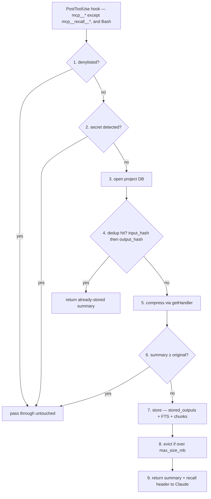

# Architecture

Orientation for contributors: how mcp-recall fits together, where each decision
lives, and the invariants a change must not break. This is the *shape* of the
system — [CONTRIBUTING.md](../CONTRIBUTING.md) has the step-by-step recipes (add a
handler, contribute a profile), the [README](../README.md) is the user-facing
framing, and `docs/*.md` are per-feature references. When a claim here disagrees
with the code, the code wins — every file-and-line pointer below is where the
source of truth actually lives.

mcp-recall is a Claude Code plugin. It has no server you run and no state beyond
per-project SQLite files. Two things execute: a **PostToolUse hook** that
intercepts large tool outputs and replaces them with short summaries, and an
**MCP server** exposing `recall__*` tools that fetch the full content back on
demand. Everything else is CLI (`mcp-recall …`) around those two.

## The capture pipeline

The hook is the heart of the system. `PostToolUse` fires on every `mcp__*` tool
(except `mcp__recall__*` — never intercept our own) and on native `Bash`. The
numbered steps in `src/hooks/post-tool-use.ts` (`handlePostToolUse`) are the
canonical order; this diagram mirrors them and stays in lockstep with that
function:

```
PostToolUse hook  ── mcp__* (except mcp__recall__*) and Bash
      │
      ▼  src/hooks/post-tool-use.ts · handlePostToolUse()
      │
 1. denylist?              ──yes──▶ pass through untouched  (return {})
      │ no
 2. extract text, scan for secrets
      │                    ──hit──▶ pass through untouched
      │ clean
 3. open project DB        getProjectKey(cwd) → defaultDbPath(key)
      │
 4. dedup: input_hash, then output_hash
      │                    ──hit──▶ return the already-stored summary
      │ miss
 5. compress               getHandler(tool_name, response, input) → handler(…)
      │
 6. summary ≥ original?    ──yes──▶ pass through untouched
      │ no
 7. store                  stored_outputs (+ FTS + chunks, via triggers)
      │
 8. evict if over store.max_size_mb   (decay-scored, pinned exempt)
      │
 9. return                 "[recall:<id> · <orig>→<sz> (NN% reduction) · search: …]\n<summary>"
```



Three of these steps are exits, not just filters: **1, 2, and 6 pass the output
through unchanged** (`return {}`) rather than storing it. Step 6 is the one that
surprises people — output that does not compress usefully (a short, error-dense
log) is left alone, so not every intercepted tool call produces a stored row.
Step 4 is the other early return: a dedup hit sends back the *existing* row's
summary and stores nothing new.

The `SessionStart` hook (`src/hooks/session-start.ts`) is the other half: it
records today's date, injects an orientation snapshot, and writes the project's
resolved path into the `meta` table — see the scoping invariant below for why
that write is guarded.

## Module map

Every path is under `src/`. The point of this list is *what owns which decision*,
so a change lands in the right file.

| Area | Files | Owns |
|------|-------|------|
| Entry | `../bin/recall`, `cli.ts`, `server.ts` | Hook/CLI dispatch; the MCP server that wires `recall__*` tools to the SDK |
| Hook pipeline | `hooks/post-tool-use.ts`, `hooks/session-start.ts` | The 9-step capture flow (source of truth) and session bootstrap |
| Filtering | `denylist.ts`, `secrets.ts` | What must never be stored — steps 1 and 2 |
| Compression | `handlers/` | Per-tool summarisation and the dispatch order (`handlers/index.ts`) |
| Profiles | `profiles/`, `learn/` | TOML compression rules in three tiers (user / community / bundled) and their generation |
| Storage | `db/` | Schema, CRUD, chunking, FTS, eviction, analytics — split by concern (see `db/index.ts` barrel) |
| Retrieval logic | `tools.ts` | Pure handlers for every `recall__*` tool; `server.ts` only wires them |
| Identity | `project-key.ts` | Resolving cwd → stable per-project key and path |
| Lifecycle | `gc/`, `import/`, `install/` | Disk reclamation, dump restore, and config install/uninstall/status |
| Support | `config.ts`, `hints.ts`, `log.ts`, `format.ts` | TOML config (Zod), search-term extraction, stderr logging, formatting |

The `db/` layer is deliberately many small files behind one re-export barrel
(`db/index.ts`): `schema.ts` (DDL + migrations), `queries.ts` (CRUD), `chunking.ts`,
`analytics.ts`, `types.ts`. Import from the barrel, not the individual files.

## Handler dispatch

`getHandler()` in `handlers/index.ts` picks the compression handler for a tool.
The order is load-bearing and documented canonically in the comment above that
function — read it there. Summarised:

1. Native `Bash` → the bash handler (routes on the command itself)
2. **User / community profiles** → beat the TypeScript handlers
3. `HANDLER_REGISTRY` → first match wins, ordered most-specific first
4. **Bundled profiles** → lose to the registry, for tools without a TS handler
5. JSON content fallback
6. CSV content fallback
7. `genericHandler` → everything else

The consequential asymmetry: *user and community* profiles override the
TypeScript registry, but *bundled* profiles sit below it. That is intentional —
a user's own rule should win, a shipped default should not silently shadow a
maintained handler.

Within `HANDLER_REGISTRY`, order matters because matchers are substring/prefix
tests that can overlap: a specific `startsWith("mcp__github__")` must precede any
broader keyword match that would also fire. Adding a handler means inserting it at
the right position, not appending — CONTRIBUTING.md Step 2 walks through this.

**Counting handlers is ambiguous** (registry entries vs. handler files vs. the
content fallbacks vs. the generic catch-all), so don't state a count in docs or
comments — point at `HANDLER_REGISTRY` as the source of truth instead.

## Data model

One SQLite database **per project**, at `~/.local/share/mcp-recall/<project-key>.db`
(`db/schema.ts` · `defaultDbPath`), created lazily. The project key is a 16-char
hash of the resolved git root (`project-key.ts`), so the same repo maps to the
same DB regardless of which subdirectory Claude launched in.

Tables (`db/schema.ts`):

- **`stored_outputs`** — one row per stored tool output: `summary`, `full_content`,
  sizes, `pinned`, `access_count`, `last_accessed`, `input_hash`, `output_hash`,
  scoped by `project_key`.
- **`outputs_fts`** (FTS5) — full-text index over `tool_name`/`summary`/`full_content`;
  powers `recall__search`. Kept in sync by insert/delete triggers.
- **`content_chunks`** (FTS5) — `full_content` split into chunks (`db/chunking.ts`);
  powers the bounded `peek` window and graduated retrieval. Populated programmatically
  by `storeChunks` on write and cleaned up by a delete trigger (unlike `outputs_fts`,
  which is fully trigger-maintained on both insert and delete).
- **`sessions`** — one row per active-use date; underpins "session days" expiry.
- **`meta`** — key/value; holds `project_path` (written by session-start). Migrations
  live in `MIGRATIONS` in `schema.ts`, applied unconditionally on open and each
  idempotent (`CREATE … IF NOT EXISTS` + a duplicate-column catch); no version row is
  tracked.

## Load-bearing invariants

These are the things that look like details and are not. Break one and the failure
is silent — a deleted database, a leaked secret, a store that never evicts. When
you touch code near one, **verify against a built store, don't reason about it**.

### 1. gc deletion safety — only absolute paths are judged

`mcp-recall gc --force` is the *only* thing in the project that deletes user data.
Its rule (`gc/index.ts`) is: recorded `project_path` gone but its parent present ⇒
project deleted ⇒ deletable. That inference is valid **only for an absolute path** —
`dirname("")` and `dirname("bare-name")` are both `"."`, which always exists, so a
relative path would read as "parent survived, project deleted" and get the DB
removed. Two defenses hold this: `project-key.ts` guarantees the recorded path is always
absolute — git's `--show-toplevel` is already absolute (and is left verbatim to
avoid re-keying every existing DB), and the non-git fallback is run through
`resolve(cwd)` rather than used bare (`project-key.ts:49-51`) — and session-start
records a path *only* when it resolves to a real directory (`session-start.ts:60`). Non-absolute
or unresolvable paths classify as `unverifiable` and are never deleted.

`STATUS_POLICY` (`gc/index.ts:55`) is the single source of truth for deletion —
a `Record<DbStatus, …>`, so adding a status without a policy is a compile error.
Only `orphaned` and `legacy-stale` are deletable; `unverifiable`, `unreadable`,
`current`, `active`, `legacy-fresh` are all kept. When changing `gc/`, build a
store containing the dangerous shapes and assert what survives.

### 2. project-key scoping — writes are scoped, by-id reads are capabilities

Writes and enumeration are all filtered by `project_key`: dedup
(`checkDedup`/`checkOutputDedup`), eviction (`evictIfNeeded` totals *and* selects
per project), `searchOutputs`, `listOutputs`, `forgetOutputs` (every branch), and
`export`. A project cannot see, evict, or delete another project's rows through
those paths.

But **operations that target a specific id are not scoped**: the reads
`retrieveOutput` (`queries.ts:111`), `retrievePeek`, `retrieveSnippet` — and the
`recordAccess` mutation that bumps `access_count` — are all `WHERE id = ?` only. The
random id acts as an unguessable capability, so a cross-project access bump is
deliberately tolerated (`pinOutput` and every `forgetOutputs` branch, by contrast,
*are* scoped). This asymmetry is deliberate but sharp-edged — it is why
`import --keep-project-key` can land rows that `retrieve`-by-id can reach yet
`forget`, `evict`, and `export` cannot (#226). The rule for new code: any query that
enumerates, or that mutates by a *non-id* selector, must carry the `project_key`
filter; only an operation targeting a specific id may omit it.

### 3. Compress only when it shrinks

Step 6 stores nothing unless `summary < original` (`post-tool-use.ts:96`). This is
why reasoning about "everything gets stored" is wrong: incompressible output passes
through untouched. Any change to compression or storage must preserve this — a
handler that returns a summary larger than its input simply won't be persisted, by
design.

### 4. HANDLER_REGISTRY is the source of truth for handlers

Don't encode a handler count anywhere. The number is ambiguous by construction
(see Dispatch above), and every past attempt to state it drifted. Documentation
and tests should reference the registry, not a tally.

## Where changes go

- **New compression handler** → CONTRIBUTING.md "Adding a compression handler"; the
  code seam is `handlers/index.ts` (`HANDLER_REGISTRY`) plus a new `handlers/*.ts`.
- **New `recall__*` tool** → a pure handler in `tools.ts`, wired in `server.ts`,
  documented in `docs/tools.md`.
- **New config key** → three places or it's undiscoverable: the Zod schema and
  `DEFAULTS` in `config.ts`, and the user-facing docs (README + `docs/`). See
  CLAUDE.md for the mechanical audit.
- **Anything near an invariant above** → build a store with the edge shapes and
  assert behaviour; these are the places where "it looks right" has been wrong.
